# Chapter 1: Techtree-Bildvorschläge

Stand: 08.10.2026. Auftrag: alle noch offenen Bäume als Bilder vorschlagen, eine gemeinsame Einstiegsübersicht mit Zählern erstellen, sauber dokumentieren und in Git sichern. Der Nutzer ist während der Ausarbeitung abwesend; offene Gestaltungsfragen wurden mit ausdrücklich markierten Annahmen behandelt. Die neuen Bilder sind Diskussionsentwürfe, keine Freigabe ihrer konkreten Knoten oder Kapitelgrenzen und keine Implementierung im Unity-Menü.

## Einstieg und Zähler

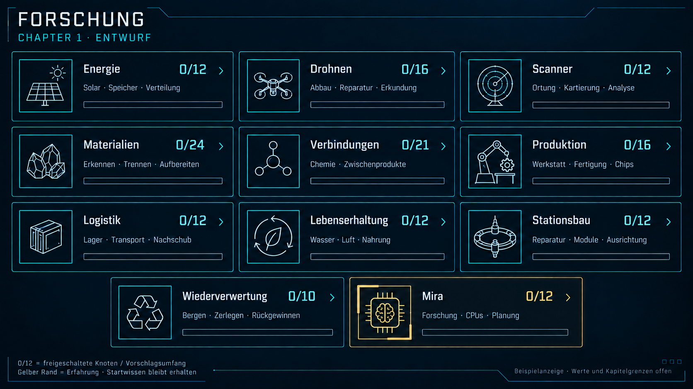

Vorschlag: Das vorhandene Forschungssymbol öffnet diese Bereichsübersicht. Jeder Eintrag öffnet seinen eigenen Baum; Zurück führt wieder zur Übersicht. Hover/Klick zeigt Bereich und Fortschritt. Im Baum bleiben quadratische Icons ohne dauerhafte Namen, versetzte quadratische Anschlüsse, Cyan-Kanten, Hover-/angeheftete Informationen und der gemeinsame Settings-Stil erhalten. Der statische Bildindex dient der Besprechung, nicht als dauerhaft geplante Beschriftung aller Icons.

| Einstieg | Beispielanzeige | Bild |
| --- | --- | --- |
| Energie | Energie 0/12 | [Öffnen](Bilder/energie-2026-10-08.png) |
| Drohnen | Drohnen 0/16 | [Öffnen](Bilder/drohnen-2026-10-08.png) |
| Scanner | Scanner 0/12 | [Öffnen](Bilder/scanner-2026-10-08.png) |
| Materialien | Materialien 0/24 | [Öffnen](Bilder/materialien-2026-10-08.png) |
| Verbindungen | Verbindungen 0/21 | [Öffnen](Bilder/verbindungen-2026-10-08.png) |
| Produktion | Produktion 0/16 | [Öffnen](Bilder/produktion-2026-10-08.png) |
| Logistik | Logistik 0/12 | [Öffnen](Bilder/logistik-2026-10-08.png) |
| Lebenserhaltung | Lebenserhaltung 0/12 | [Öffnen](Bilder/lebenserhaltung-2026-10-08.png) |
| Stationsbau | Stationsbau 0/12 | [Öffnen](Bilder/station-2026-10-08.png) |
| Wiederverwertung | Wiederverwertung 0/10 | [Öffnen](Bilder/wiederverwertung-2026-10-08.png) |
| Mira | Mira 0/12 | [Öffnen](Bilder/mira-2026-10-08.png) |

Die Zahl hinter dem Schrägstrich ist die Zahl unterschiedlicher sichtbarer Knoten dieses Vorschlags. Startgrundlagen zählen im späteren echten Spiel bereits als bekannt; die Null ist ein absichtlich vereinheitlichtes Mockup, kein neuer Startzustand. Wiederholte Erfahrungslevel erhöhen den Zähler nicht erneut. Für einen Stufenknoten wie Miras Forschungsstufe 2 zählt das erstmalige Erreichen. Ziel-/Wiederherstellungsknoten zählen als erreicht, wenn ihre noch auszulegenden Bedingungen erfüllt sind. Ein vollständiger Zähler bedeutet nicht automatisch Kapitelabschluss.

Bereichsbäume dürfen auf gemeinsame Fähigkeiten verweisen: Wasseraufbereitung wird beispielsweise aus Materialien in Lebenserhaltung angezeigt und nur einmal erforscht. In beiden Bereichszählern kann derselbe bekannte Knoten erscheinen; die Bereichszahlen werden deshalb nicht als globale Anzahl einzigartiger Forschungen aufsummiert. Eine spätere Änderung der Kapitelgrenzen kann die Nenner verändern. Ausblickkarten für spätere Kapitel und externe Voraussetzungskarten gehören nicht zum Nenner.

Der gelbe/amberfarbene Füllrand zeigt praktische Erfahrung zum nächsten Level innerhalb eines Knotens. Das Informationsfeld erklärt Tätigkeit, aktuellen Level, Fortschritt und nächste Verbesserung. Zustand/Verschleiß, Forschung/Freischaltung, Auswahl und Erfahrung haben getrennte Anzeigen. In den Rasterentwürfen sind konkrete Prozent-/Füllwerte reine Darstellungsbeispiele; sie legen keine Balance fest.

## Gemeinsame Annahmen und Abhängigkeiten

- Vorhandene Starttechnik und Miras Stimme/Persönlichkeit bleiben bekannt beziehungsweise verfügbar. Es gibt keinen Forschungsneustart.
- Forschung schaltet Wissen/Verfahren frei. Reparatur, Umbau, Herstellung, Proben und Teile müssen mit passenden Anlagen/Drohnen tatsächlich ausgeführt oder beschafft werden.
- Materialerkennung, passende Stofftrennung, nutzbare Qualität, reale Vorräte und Produktionsverfahren sind eigene Bedingungen.
- Neue selbst gefertigte CPUs brauchen Chipfertigung, Elektronikmontage und tatsächlichen Einbau. Zusätzliche Rechenleistung benötigt Strom und Wärmeabfuhr. Forschungsstufe 2 kann schon in Chapter 1 erreichbar sein; sie bedeutet nicht Chapter 2.
- Vier Drohnenarten bleiben die Arbeitsgliederung. Eine neue Bergungsdrohnenart wird nicht eingeführt. Interne und äußere Hardware sind nicht beliebig austauschbar; neue Generationen folgen Wiederverwertung/Neubau.
- Logistik nutzt Drohnen und zugängliche Transportwege. Keine Förderbänder.
- Stationsreisen folgen Chapter 2. Lokale Lagekontrolle/Ausrichtung bleibt ein abzugrenzender Chapter-1-Vorschlag; automatische Panelnachführung ist ein optionaler späterer Ausbau.
- Pflanzen/Algen benötigen gefundene Samen beziehungsweise geeignetes biologisches Ausgangsmaterial, Bioreaktoren geeignete lebende Kulturen. Die entsprechenden Bildkarten sind spätere Ausblicke. Chemische Zwischenstoffe allein sind keine vollständige sichere Ernährung.

Cyan-Kanten zeigen vorgeschlagene Hauptpfade. Die Textbedingungen ergänzen die übersichtlich gehaltenen Bilder um Voraussetzungen aus anderen Bäumen, tatsächliche Hardware und Versorgung. Mehrere Bedingungen sind gemeinsam zu erfüllen. Die Reihenfolgen sind Gestaltungsvorschläge und keine Behauptung, dass beispielsweise jeder Behältertyp oder jeder chemische Stoff naturgesetzlich den vorigen voraussetzt.

## Sieben neu ausgearbeitete Bäume

### Mira · 0/12

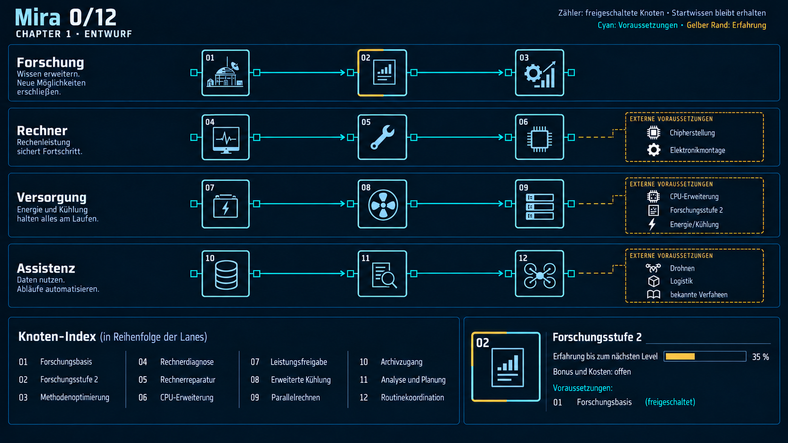

| Zweig | Vorgeschlagene Knoten |
| --- | --- |
| Forschung | 01 Forschungsbasis → 02 Forschungsstufe 2 → 03 Methodenoptimierung |
| Rechner | 04 Rechnerdiagnose → 05 Rechnerreparatur → 06 CPU-Erweiterung |
| Versorgung | 07 Leistungsfreigabe → 08 Erweiterte Kühlung → 09 Parallelrechnen |
| Assistenz | 10 Archivzugang → 11 Analyse und Planung → 12 Routinekoordination |

Zusätzliche Voraussetzungen:

- CPU-Erweiterung: Chipherstellung + Elektronikmontage.
- Parallelrechnen: CPU-Erweiterung + Forschungsstufe 2 + Energie/Kühlung.
- Routinekoordination: Drohnen + Logistik + bekannte Verfahren.

Forschungsbasis ist Startwissen. Forschungsstufe 2 entsteht durch abgeschlossene Forschung; Schwellen und Methodenbonus offen. Hardwareinstallation durch Helfer. CPU-Neufertigung und parallele Forschung: Chapter-1-Grenze offen. Archive liefern nur tatsächlich vorhandene Daten; Routineaufträge innerhalb freigegebener Regeln.

### Drohnen und Robotik · 0/16

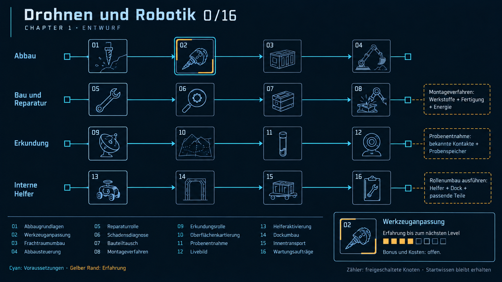

| Zweig | Vorgeschlagene Knoten |
| --- | --- |
| Abbau | 01 Abbaugrundlagen → 02 Werkzeuganpassung → 03 Frachtraumumbau → 04 Abbausteuerung |
| Bau und Reparatur | 05 Reparaturrolle → 06 Schadensdiagnose → 07 Bauteiltausch → 08 Montageverfahren |
| Erkundung | 09 Erkundungsrolle → 10 Oberflächenkartierung → 11 Probenentnahme → 12 Livebild |
| Interne Helfer | 13 Helferaktivierung → 14 Dockumbau → 15 Innentransport → 16 Wartungsaufträge |

Zusätzliche Voraussetzungen:

- Rollenumbau ausführen: Helfer + Dock + passende Teile.
- Probenentnahme: bekannte Kontakte + Probenspeicher.
- Montageverfahren: Werkstoffe + Fertigung + Energie.

Vier Arten, keine fünfte Bergungsdrohne. Abbaugrundlagen sind Startwissen. Livebild erfordert Bildsensoren und Datenverbindung; Probenentnahme erfordert Werkzeuge, daher die gezeichnete Kette als Ausbaureihenfolge, nicht naturgesetzliche Abhängigkeit. Innentransport ergänzt Helferrolle. Rollenwechsel ist realer Umbau; neue technische Generationen benötigen Wiederverwertung/Neubau. Kleine Innen- und große Außenhardware nicht pauschal austauschbar.

### Scanner und Erkundung · 0/12

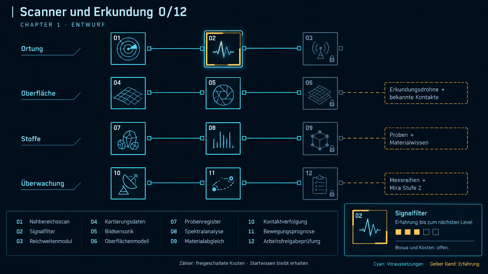

| Zweig | Vorgeschlagene Knoten |
| --- | --- |
| Ortung | 01 Nahbereichsscan → 02 Signalfilter → 03 Reichweitenmodul |
| Oberfläche | 04 Kartierungsdaten → 05 Bildsensorik → 06 Oberflächenmodell |
| Stoffe | 07 Probenregister → 08 Spektralanalyse → 09 Materialabgleich |
| Überwachung | 10 Kontaktverfolgung → 11 Bewegungsprognose → 12 Arbeitsfreigabeprüfung |

Zusätzliche Voraussetzungen:

- Oberflächenmodell: Erkundungsdrohne + bekannte Kontakte.
- Materialabgleich: Proben + Materialwissen.
- Bewegungsprognose: Messreihen + Mira Stufe 2.

Nahbereichsscan ist vorhandene Starttechnik; keine erneute Freischaltung. Kartierung, Bildgebung und Stoffnachweis getrennt von Ortung. Spektralanalyse hängt von geeigneten Messgeräten und Proben ab; nicht jede Substanz aus Ferne bestimmbar. Arbeitsfreigabeprüfung verbessert bereits bestehende Freigaberegeln, erlaubt keine Flüge zu unbekannten Kontakten. Keine Stationsreise durch diesen Baum.

### Produktion und Fertigung · 0/16

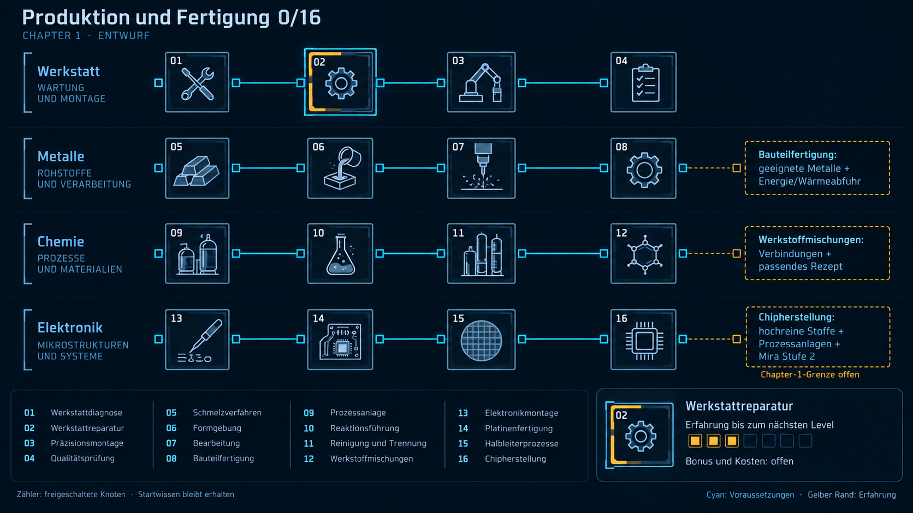

| Zweig | Vorgeschlagene Knoten |
| --- | --- |
| Werkstatt | 01 Werkstattdiagnose → 02 Werkstattreparatur → 03 Präzisionsmontage → 04 Qualitätsprüfung |
| Metalle | 05 Schmelzverfahren → 06 Formgebung → 07 Bearbeitung → 08 Bauteilfertigung |
| Chemie | 09 Prozessanlage → 10 Reaktionsführung → 11 Reinigung und Trennung → 12 Werkstoffmischungen |
| Elektronik | 13 Elektronikmontage → 14 Platinenfertigung → 15 Halbleiterprozesse → 16 Chipherstellung |

Zusätzliche Voraussetzungen:

- Bauteilfertigung: geeignete Metalle + Energie/Wärmeabfuhr.
- Werkstoffmischungen: Verbindungen + passendes Rezept.
- Chipherstellung: hochreine Stoffe + Prozessanlagen + Mira Stufe 2.

Grundlagen pro Anlage abhängig von vorhandenem Startbestand. Wiederherstellung kann mit geborgenen Teilen beginnen. Zweige zeigen Ausbaureihenfolgen; Qualitätsprüfung und Werkstatt sind zusätzliche Bedingungen anderer Zweige. Elektronikmontage kann geborgene Chips nutzen. Neue Chips verlangen mehr als Silizium: Prozessstoffe, Reinheit, Ausstattung, Verpackung/Tests; vollständige Halbleiterfertigung in Chapter 1 bleibt ambitioniert und offen. Keine vollständigen Rezepturen mit diesem Entwurf festgelegt.

### Lagerung und Logistik · 0/12

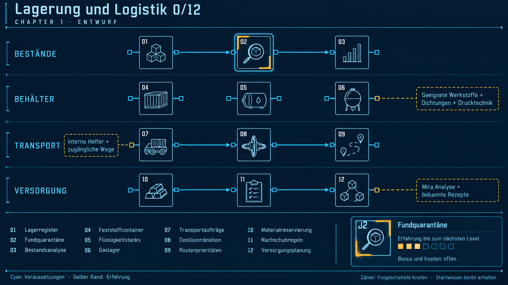

| Zweig | Vorgeschlagene Knoten |
| --- | --- |
| Bestände | 01 Lagerregister → 02 Fundquarantäne → 03 Bestandsanalyse |
| Behälter | 04 Feststoffcontainer · 05 Flüssigkeitstanks · 06 Gaslager |
| Transport | 07 Transportaufträge → 08 Dockkoordination → 09 Routenprioritäten |
| Versorgung | 10 Materialreservierung → 11 Nachschubregeln → 12 Versorgungsplanung |

Zusätzliche Voraussetzungen:

- Transportaufträge: interne Helfer + zugängliche Wege.
- Gaslager: geeignete Werkstoffe + Dichtungen + Drucktechnik.
- Versorgungsplanung: Mira Analyse + bekannte Rezepte.

Feststoffe, Flüssigkeiten und Gase sind gleichrangige Behälterzweige, keine lineare Freischaltkette. Unbekannte Funde gesondert lagern; keine nutzbare Rohstoffmenge bis zur Identifikation. Transport nur durch geeignete Drohnen, keine Förderbänder. Gaslager verlangt stoff- und zustandsgeeignete Technik; Details offen. Bestandsanalyse benötigt Register; Versorgung nutzt reale Mengen, Reservierungen und Produktionskapazitäten.

### Lebenserhaltung und Nahrung · 0/12

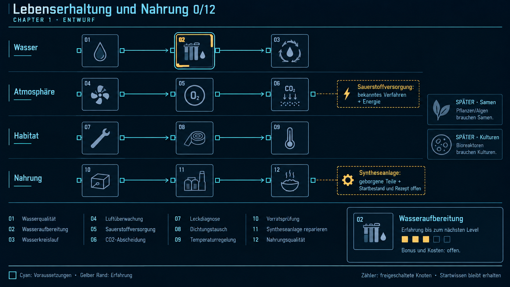

| Zweig | Vorgeschlagene Knoten |
| --- | --- |
| Wasser | 01 Wasserqualität → 02 Wasseraufbereitung → 03 Wasserkreislauf |
| Atmosphäre | 04 Luftüberwachung → 05 Sauerstoffversorgung → 06 CO2-Abscheidung |
| Habitat | 07 Leckdiagnose → 08 Dichtungstausch → 09 Temperaturregelung |
| Nahrung | 10 Vorratsprüfung → 11 Syntheseanlage reparieren → 12 Nahrungsqualität |

Zusätzliche Voraussetzungen:

- Sauerstoffversorgung: bekanntes Verfahren + Energie.
- Syntheseanlage: geborgene Teile + freigegebenes Verfahren.
- Spätere Kapitel: Pflanzen/Algen brauchen Samen; Bioreaktoren brauchen Kulturen.

Vorhandene Luft-/Wasserversorgung bleibt Startbestand; Erweiterungen und Prüftechnik ergänzen sie. Wasseraufbereitung aus Materialbaum ist ein gemeinsamer referenzierter Knoten, kein zweiter Kauf. Sauerstoffproduktion ist von Luftmischung/Druckregelung abhängig. Nahrungspfad stellt nur einen möglichen vorhandenen Synthesizer wieder her; dessen Startbestand, sichere vollständige Ernährung und Verfahren bleiben offen. Formaldehyd ist keine Nahrung. Pflanzen-/Algen- und Mikrobenpfade als getrennte spätere Ausblickkarten, nicht Teil der12 Chapter-1-Vorschlagsknoten. Leckdiagnose/Dichtungstausch sind gemeinsam referenzierte Reparaturfähigkeiten.

### Stationsbau und Infrastruktur · 0/12

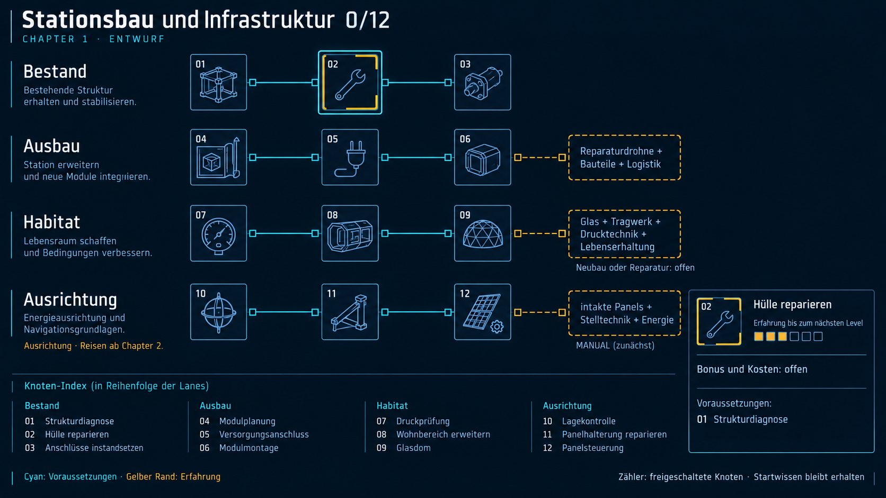

| Zweig | Vorgeschlagene Knoten |
| --- | --- |
| Bestand | 01 Strukturdiagnose → 02 Hülle reparieren → 03 Anschlüsse instandsetzen |
| Ausbau | 04 Modulplanung → 05 Versorgungsanschluss → 06 Modulmontage |
| Habitat | 07 Druckprüfung → 08 Wohnbereich erweitern → 09 Glasdom |
| Ausrichtung | 10 Lagekontrolle → 11 Panelhalterung reparieren → 12 Panelsteuerung |

Zusätzliche Voraussetzungen:

- Modulmontage: Reparaturdrohne + Bauteile + Logistik.
- Glasdom: Glas + Tragwerk + Drucktechnik + Lebenserhaltung.
- Panelsteuerung: intakte Panels + Stelltechnik + Energie.

Strukturdiagnose ergänzt den bekannten Stationsbestand. Bestehender begehbarer Ring/Wohnraum wird nicht erneut freigeschaltet. Modulbau braucht vorausgehende Struktur-/Anschlussprüfung, Versorgung und Druckprüfung als zusätzliche Bedingungen. Glasdom-Neubau versus Reparatur eines vorhandenen Doms offen. Lagekontrolle umfasst Orientierung, keine Reise zu Planeten. Panelsteuerung zunächst manuell; automatische Nachführung späterer optionaler Ausbau außerhalb der12Knoten. Körperrotation und lokale Lagekorrektur versus Chapter-2-Reise weiter abzugrenzen.

## Vier bereits besprochene Bäume

### Energieversorgung · 0/12

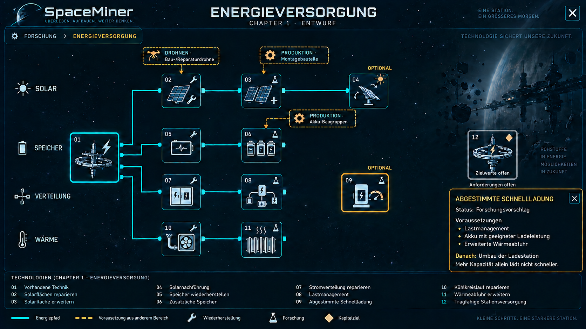

01 Vorhandene Technik; 02 Solarflächen reparieren; 03 Solarfläche erweitern; 04 Solarnachführung; 05 Speicher wiederherstellen; 06 Zusätzliche Speicher; 07 Stromverteilung reparieren; 08 Lastmanagement; 09 Abgestimmte Schnellladung; 10 Kühlkreislauf reparieren; 11 Wärmeabfuhr erweitern; 12 Tragfähige Stationsversorgung.

Solar, Speicher, Verteilung und Wärme bilden eigene Pfade. Solarnachführung und Schnellladung sind optionale Verbesserungen. Nachführung folgt einem späteren Ausbau; die manuelle Panelsteuerung steht im Stationsbaum. Der bestehende kleine Kernreaktor bleibt Teil des Anfangsbestands. Akkukapazität und Ladeleistung sind getrennt. Schnellladung braucht Lastmanagement, einen geeigneten Akku und Wärmeabfuhr; die kurze08→09-Verbindung fehlt in der korrigierten Rastervorschau, wird aber im Overlay und hier benannt. Knoten12 steht bewusst als unverbundener Zielplatzhalter mit offenen Leistungs-/Reserveanforderungen. Keine pauschale Pflicht, sämtliche Erweiterungen zu erforschen, und keine feste Kapitelabschlussbedingung aus dem Bild ableiten.

### Wiederverwertung · 0/10

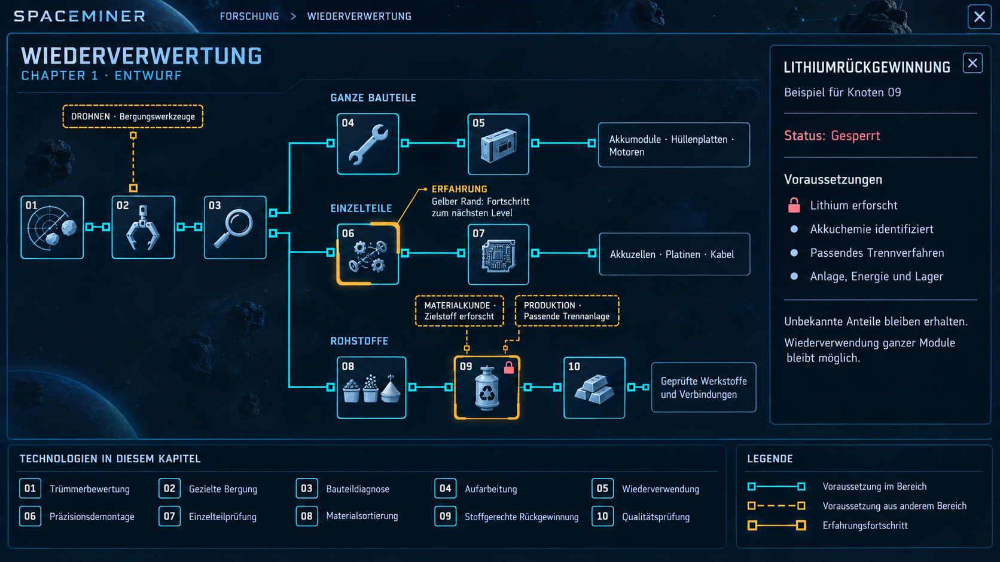

01 Trümmerbewertung; 02 Gezielte Bergung; 03 Bauteildiagnose; 04 Aufarbeitung; 05 Wiederverwendung; 06 Präzisionsdemontage; 07 Einzelteilprüfung; 08 Materialsortierung; 09 Stoffgerechte Rückgewinnung; 10 Qualitätsprüfung.

Gemeinsamer Einstieg Bewertung → Bergung → Diagnose, dann die drei alternativen Wege Wiederverwendung, Demontage und stoffgerechte Rückgewinnung. Dieselben Teile werden nicht mehrfach als Modul, Einzelteile und Rohstoffe ausgegeben. Zielstoffkenntnis und passende Verfahren sind Bedingungen der gezielten Rohstoffrückgewinnung. Details und Quellen: [Wiederverwertung](../Wiederverwertung.md).

### Materialien · 0/24

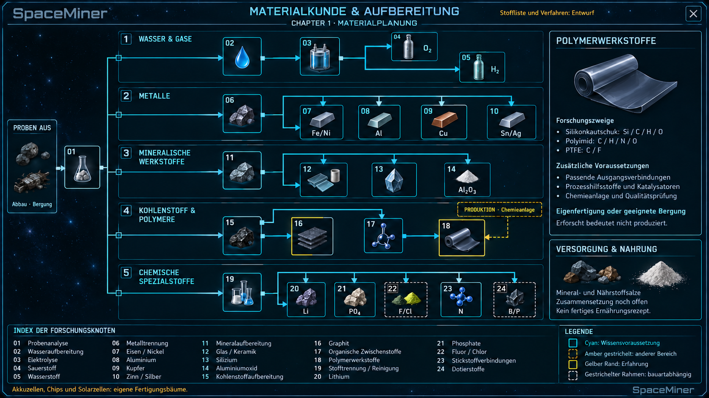

Wasser/Gase, Metalle, mineralische Werkstoffe, Kohlenstoff/Polymere und chemische Spezialstoffe. Graphit und organische Zwischenstoffe sind Geschwisterzweige. Die Sammlung ist keine verbindliche vollständige Kapitelstückliste und verspricht weder bestimmte Lagerstätten noch volle Eigenfertigung. IDs, Voraussetzungen und Quellen: [Werkstoffe und Rohstoffe](../Werkstoffe-und-Rohstoffe.md) sowie [Strukturdaten](entwuerfe-2026-10-08.json).

### Verbindungen · 0/21

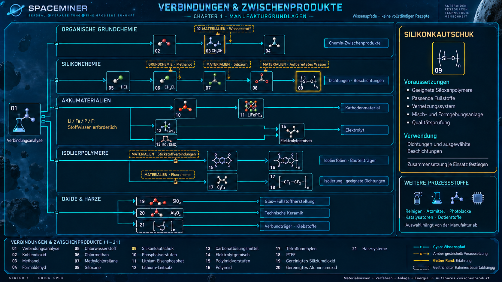

Organische Grundchemie, Silikonchemie, Akkumaterialien, Isolierpolymere und Oxide/Harze. Kathodenmaterial und Elektrolyt sind getrennte Wege; Elektrolyt verlangt Leitsalz und passende Lösungsmittel. Der Rasterentwurf zeigt beim PTFE-Icon dekorativ eine zusätzliche17; der Zielknoten ist18 laut Index/Text. Chemische Wissenspfade ersetzen keine vollständigen Reaktions-/Produktionsrezepte. IDs, Voraussetzungen und Quellen: [Verbindungen und Zwischenprodukte](../Verbindungen-und-Zwischenprodukte.md).

## Wichtige Verknüpfungen für die weitere Ausarbeitung

| Ziel | Benötigte Fortschritte / Arbeitsmittel |
| --- | --- |
| Erste Außendrohne zur Reparaturrolle umbauen | Miras vorhandene Forschung, Rollenwissen, aktivierter Helfer, Dock und geeignete Teile. |
| Solarflächen instandsetzen | Reparaturdrohne, Schadensdiagnose, vorhandene oder geborgene passende Solarbauteile, Energie. |
| Unbekannte Rohstoffe zurückgewinnen | Erreichbare Funde → Materialanalyse/Zielstoffwissen → passendes Wiederverwertungsverfahren → Anlage, Lager und Energie. |
| Neue CPU selbst herstellen und Mira ausbauen | Geeignete bekannte hochreine Materialien/Prozessstoffe → Halbleiter-/Chipfertigung → Elektronikmontage/Tests → Helfereinbau → versorgte und gekühlte Rechenhardware. |
| Komplexe Analyse bearbeiten | Vorgeschlagene Mira-Forschungsstufe 2, passende Sensor-/Probendaten und nutzbare Rechenleistung. |
| Routinewartung koordinieren | Bekannte Reparaturverfahren, Zustandsdaten, ausführende Helfer/Reparaturdrohnen, Ersatzteile und freigegebene Auftragsregeln. |
| Neues Habitatmodul nutzen | Planung, tragfähige Struktur, Montage, Versorgungsanschluss, Druckprüfung und passende Lebenserhaltung. |

Der Anfang besitzt genug bekannte Technik für erste Projekte und Reparaturen. Frühe Elektronik-/Anlagenreparatur kann geeignete geborgene Komponenten nutzen. Die neue CPU-Fertigung wird dadurch nicht zur Voraussetzung für Miras erste Forschung. Die Wiederherstellung einer Werkstatt oder möglicher Syntheseanlage braucht keinen vollständigen Neubau aller internen Chips.

## Offene Entscheidungen und Bildgrenzen

Zu besprechen: genaue Chapter-1-Endknoten, Ausmaß der selbständigen Chip-/Akku-/Solarfertigung, verfügbare Rohstoffe und Fundorte, vorhandene Nahrungsanlage und sichere vollständige Rezepte, Startbestände, Forschungsstufen/Schwellen, konkrete Boni, Energie-/Wärme-/Materialbilanzen, Forschungsdauer/Parallelisierung, Verschleißmodell und Umfang automatischer Aufträge. Keine dieser Zahlen oder technischen Bauarten ist durch die Bildgenerierung festgelegt.

Die Bilder sind Rastermockups. Sie vereinfachen teilweise externe Voraussetzungen als Karten am Ende einer Zeile statt am exakten Knoten, etwa Probenentnahme, Bewegungsprognose, Sauerstoffversorgung und Syntheseanlage. Maßgebliche Zuordnung steht in den nummerierten Texten und Strukturdaten. Einzelne Anschluss-/Nummerierungsabweichungen sind kein implementierbarer Technologiekatalog. Technische Verfahren vor Gameplayumsetzung anhand geeigneter Primärquellen auslegen; bereits recherchierte Orientierungen stehen in den verlinkten Fachdokumenten.

## Dateien, Herkunft und Prüfung

Alle zwölf ausgewählten PNGs liegen unter [Bilder](Bilder/); sieben fehlende Bäume und die Einstiegsübersicht sind neu erzeugt, vier frühere Entwürfe übernommen, Energie/Übersicht/Mira gezielt korrigiert. Generierung über das eingebaute Imagegen-Werkzeug. Die neuen vollständigen Prompts und Korrekturprompts stehen in [entwuerfe-2026-10-08.json](entwuerfe-2026-10-08.json). Frühere vollständige Erstprompts wurden nicht rekonstruiert.

Zusammen mit den PNGs enthält die JSON Knoten-IDs, Namen, vorgeschlagene Hauptkanten, Bedingungen, Zähler und offene Annahmen. Sie ist Dokumentation, keine vom Spiel geladene Katalogdatei. Ablage bewusst außerhalb Assets: keine Unity-Texturimporte oder neuen .meta-Dateien erforderlich. Aktuelle Spielimplementierung weiterhin [Techtree](../Techtree.md), bestätigte Gestaltung [Spielidee](../Spielidee.md), detaillierte Mira-Planung [Mira-Entwicklung](../Mira-Entwicklung.md).

Tatsächliche Prüfung dieser Aufgabe: alle ausgewählten Rasterbilder visuell geprüft, Zähler mit Knotenlisten abgeglichen; JSON-Syntax, eindeutige IDs, gültige Kantenenden und Zyklusfreiheit der dargestellten Hauptpfade geprüft; lokale Bild-/Dokumentlinks und PNG-Dateien geprüft; Git-Diff auf Formatfehler und Commitumfang geprüft. Gegenbeispiele aus dem Bildabgleich sind oben ausdrücklich vermerkt. Keine Code-/Szenenänderung, keine neuen Gameplayprüfungen oder Unity-Builds. Frühere im Projekt dokumentierte Testergebnisse werden nicht als Prüfung dieser Entwürfe übernommen.

Prüfbericht mit Knotenzahlen, Hauptkanten, Bildabmessungen und SHA-256-Werten: [pruefung-2026-10-08.json](pruefung-2026-10-08.json). Die automatischen Strukturprüfungen bestätigen Dateikonsistenz, nicht die technische Vollständigkeit der vorgeschlagenen Verfahren.
